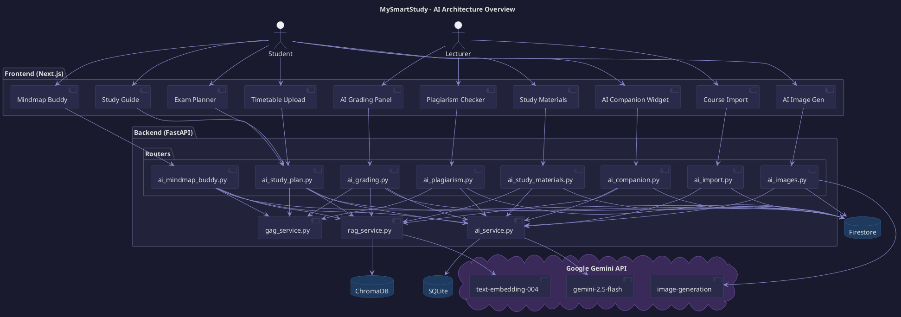
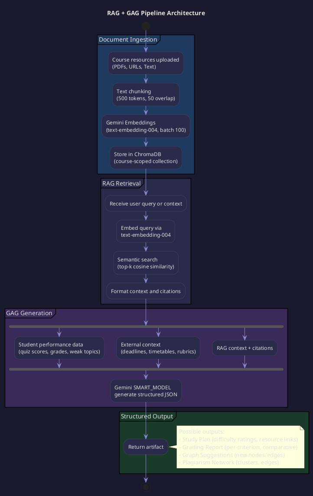
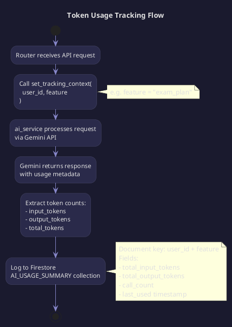

# MySmartStudy AI Architecture

## PlantUML Diagrams

### 1. High-Level AI System Architecture

### 2. Data Flow Per AI Feature

```plantuml
@startuml AI_Data_Flows

skinparam backgroundColor #1a1a2e
skinparam defaultFontColor #e0e0e0
skinparam packageBackgroundColor #22223a
skinparam packageBorderColor #4a4a6a
skinparam componentBackgroundColor #2a2a4a
skinparam componentBorderColor #4a4a6a
skinparam arrowColor #8888cc
skinparam noteBorderColor #4a4a6a
skinparam noteBackgroundColor #2a2a3e

title AI Features - Data Sources and Outputs

package "1. AI Companion" {
  component "Enrolled courses\nQuiz scores\nAssignment grades\nTimetables\nReminders\nLearning profile (VARK)\nChat history (15 msgs)" as comp_in
  component "RAG retrieval\nSMART_MODEL chat\nLearning style adapt" as comp_proc
  component "Conversational response\nSource citations" as comp_out
}
comp_in --> comp_proc
comp_proc --> comp_out
note bottom of comp_out : Cache: 7d (non-course queries)

package "2. Exam Plan" {
  component "Selected courses\nExam dates\nTopics list" as exam_in
  component "FAST_MODEL\ngenerate_json\nSchedule optimization" as exam_proc
  component "Daily sessions\nDuration per session\nPersonalized tips" as exam_out
}
exam_in --> exam_proc
exam_proc --> exam_out
note bottom of exam_out : Cache: by exam hash

package "3. Daily Study Guide" {
  component "Enrolled courses\nQuiz scores / grades\nWeak topics\nTimetables\nDeadlines" as guide_in
  component "RAG weak topics\nGAG study plan\nTimetable scheduling" as guide_proc
  component "Time-slotted recs\nDifficulty ratings\nResource links\nMotivational message" as guide_out
}
guide_in --> guide_proc
guide_proc --> guide_out
note bottom of guide_out : Cache: 24 hours

package "4. Study Materials" {
  component "Resource content\nCourse materials (RAG)\nTopic query" as mat_in
  component "FAST_MODEL\ngenerate_json\nRAG grounding" as mat_proc
  component "Markdown summaries\nFlashcard arrays\nPractice quizzes" as mat_out
}
mat_in --> mat_proc
mat_proc --> mat_out
note bottom of mat_out : Cache: 7d dedup

package "5. Mindmap Buddy" {
  component "Map nodes/edges\nTask description\nEnrolled courses\nChat history\nUser preferences" as map_in
  component "SMART_MODEL\nRAG course content\nGAG graph suggestions\nKnowledge graph" as map_proc
  component "Rating (1-10)\nStrengths\nSuggested nodes\nStructure feedback" as map_out
}
map_in --> map_proc
map_proc --> map_out
note bottom of map_out : Cache: 2h analysis, 24h recs

package "6. AI Grading" {
  component "Submission content\nRubric criteria\nClass statistics\nSimilar submissions (RAG)" as grade_in
  component "SMART_MODEL via GAG\nComparative analysis\nPer-criterion scoring" as grade_proc
  component "Recommended grade\nPer-criterion report\nConfidence score\nImprovement tips" as grade_out
}
grade_in --> grade_proc
grade_proc --> grade_out
note bottom of grade_out : Cache: once per submission

package "7. Plagiarism Detection" {
  component "Submission text\nAll submissions\nKnowledge graph" as plag_in
  component "SMART_MODEL analysis\nGAG network analysis\nCluster detection" as plag_proc
  component "Plagiarism percentage\nSource types\nSimilarity edges\nCluster narrative" as plag_out
}
plag_in --> plag_proc
plag_proc --> plag_out
note bottom of plag_out : Cache: once per submission

package "8. AI Image Generation" {
  component "Text prompt\nStyle preset\nUser ID (quota)" as img_in
  component "SMART_MODEL elaboration\nImage generation model" as img_proc
  component "Generated image\nElaborated prompt" as img_out
}
img_in --> img_proc
img_proc --> img_out
note bottom of img_out : Quota: 1/day, dedup 7d

package "9. Timetable Extraction" {
  component "Timetable text\nor PDF upload" as tt_in
  component "FAST_MODEL\nstructured extraction" as tt_proc
  component "Parsed schedule\nRecommended study slots" as tt_out
}
tt_in --> tt_proc
tt_proc --> tt_out
note bottom of tt_out : Cache: 30 days

package "10. Course Import" {
  component "Google Sites URL\nCourse ID" as ci_in
  component "FAST_MODEL structuring\nWeb scraping" as ci_proc
  component "Modules with items\nCourse name/code" as ci_out
}
ci_in --> ci_proc
ci_proc --> ci_out
note bottom of ci_out : Cache: 24h per URL

@enduml
```

### 3. RAG + GAG Pipeline

### 4. Caching and Storage Architecture

```plantuml
@startuml Caching_Architecture

skinparam backgroundColor #1a1a2e
skinparam defaultFontColor #e0e0e0
skinparam packageBackgroundColor #22223a
skinparam packageBorderColor #4a4a6a
skinparam componentBackgroundColor #1e3a5f
skinparam componentBorderColor #3a6a9f
skinparam databaseBackgroundColor #1e3a5f
skinparam databaseBorderColor #3a6a9f
skinparam arrowColor #8888cc

title AI Caching and Storage Strategy

package "Firestore Collections" {

  package "Study Plan Cache" {
    component "AI_DAILY_GUIDE_CACHE\nTTL: 24h" as dgc
    component "AI_EXAM_PLAN_CACHE\nhash-keyed" as epc
    component "AI_STUDY_PLANS\npersisted" as sp
    component "SAVED_TIMETABLES" as st
    component "AI_TIMETABLE_CACHE\nTTL: 30d" as tc
  }

  package "Materials Cache" {
    component "GENERATED_STUDY_MATERIALS\nTTL: 7d dedup" as gsm
  }

  package "Companion State" {
    component "AI_CHAT_HISTORY\n15 msgs per user" as ch
    component "AI_COMPANION_QUESTION_CACHE\nTTL: 7d" as qc
    component "LEARNING_PROFILES\nVARK style" as lp
  }

  package "Mindmap Buddy State" {
    component "AI_MAP_ANALYSIS_CACHE\nTTL: 2h" as mac
    component "AI_NODE_RECS_CACHE\nTTL: 24h" as nrc
    component "AI_SUGGEST_ALL_CACHE" as sac
    component "AI_MINDMAP_BUDDY_MEMORY\n30 msgs + prefs" as mbm
  }

  package "Grading and Plagiarism" {
    component "AI_GRADE_RECOMMENDATIONS\none per submission" as agr
    component "AI_PLAGIARISM_REPORTS\none per submission" as apr
  }

  package "Image Generation" {
    component "AI_IMAGE_CACHE\nTTL: 7d dedup" as ic
    component "AI_IMAGE_QUOTAS\n1/day per user" as iq
    component "AI_ELABORATION_CACHE\nTTL: 30d" as ec
  }

  package "Import" {
    component "AI_IMPORT_CACHE\nTTL: 24h per URL" as imc
  }

  package "Usage Tracking" {
    component "AI_USAGE_SUMMARY\ntokens per feature" as aus
  }
}

database "ChromaDB\nVector Store" as chroma
note right of chroma
  Per-course collections
  Embedded text chunks
  Cosine similarity search
end note

database "SQLite\nmysmartstudy.db" as sqlite
note right of sqlite
  Users, Courses
  Assignments, Submissions
  Quizzes, Grades
end note

@enduml
```

### 5. Token Usage Tracking Flow

## Feature Summary Table

| # | Feature | Endpoint | Model | Data Sources | Cache TTL |
|---|---------|----------|-------|-------------|-----------|
| 1 | AI Companion | `POST /ai/companion/chat` | SMART | Courses, grades, timetables, learning profile, RAG | 7d (questions) |
| 2 | Exam Plan | `POST /ai/study-plan/exam-plan` | FAST | Exam dates, topics | By hash |
| 3 | Daily Guide | `GET /ai/study-plan/daily-guide` | FAST + GAG | Courses, grades, timetables, deadlines, RAG | 24h |
| 4 | Study Materials | `POST /ai/study-materials/generate` | FAST | Resource content, RAG | 7d dedup |
| 5 | Mindmap Buddy | `POST /ai/mindmap-buddy/*` | SMART | Map data, courses, RAG, preferences | 2h-24h |
| 6 | AI Grading | `POST /ai/grading/recommend/{id}` | SMART + GAG | Submission, rubric, class stats, RAG | Once |
| 7 | Plagiarism | `POST /ai/plagiarism/analyze/{id}` | SMART + GAG | Submissions, similarity graph | Once |
| 8 | Image Gen | `POST /ai/images/generate` | SMART + Image | Prompt, style | 7d dedup, 1/day |
| 9 | Timetable | `POST /ai/study-plan/timetable-*` | FAST | Text/PDF | 30d |
| 10 | Course Import | `POST /ai/import/google-sites` | FAST | Google Sites URL | 24h |
