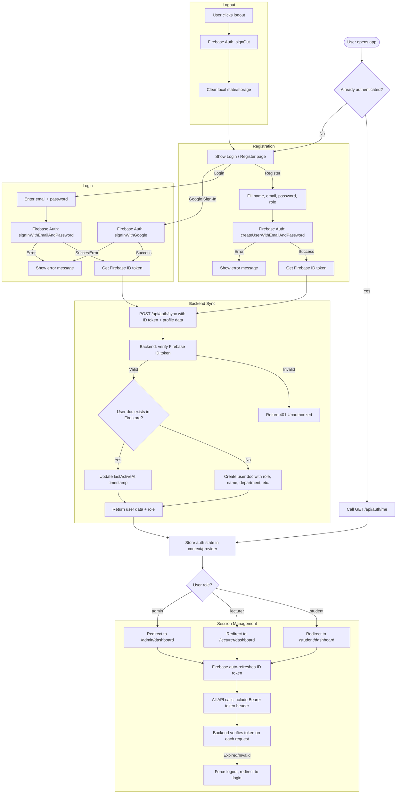

# Authentication Flow

## Overview
Handles user registration, login via Firebase Auth, backend synchronization, and role-based dashboard routing. Supports email/password and Google Sign-In on mobile.

## Flowchart

## Key Files
- `frontend-web/src/contexts/auth-context.tsx` — AuthProvider with Firebase onAuthStateChanged
- `frontend-web/src/lib/api.ts` — getFirebaseToken() helper, authApi namespace
- `frontend-web/src/app/(auth)/login/page.tsx` — Login page
- `frontend-web/src/app/(auth)/register/page.tsx` — Register page
- `frontend-mobile/lib/services/auth_service.dart` — Firebase Auth wrapper
- `frontend-mobile/lib/screens/login_screen.dart` — Mobile login
- `backend/app/auth.py` — get_current_user() dependency, Firebase token verification
- `backend/app/routers/auth.py` — POST /api/auth/sync, GET /api/auth/me
