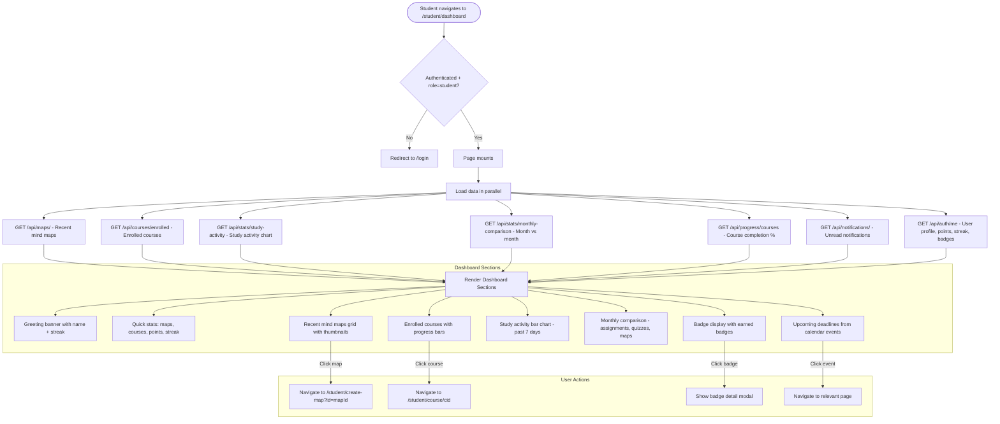

# Student Dashboard Flow

## Overview
The student dashboard is the main landing page after login. It aggregates data from multiple API endpoints to display recent mind maps, enrolled courses, study activity stats, badges, and quick-access features.

## Flowchart

## Key Files
- `frontend-web/src/app/(dashboard)/student/dashboard/page.tsx` — Main dashboard page
- `frontend-web/src/lib/api.ts` — mapsApi, coursesApi, statsApi, progressApi, notificationsApi
- `frontend-mobile/lib/screens/home_screen.dart` — Mobile dashboard
- `backend/app/routers/stats.py` — Study activity statistics
- `backend/app/routers/progress.py` — Course completion progress
