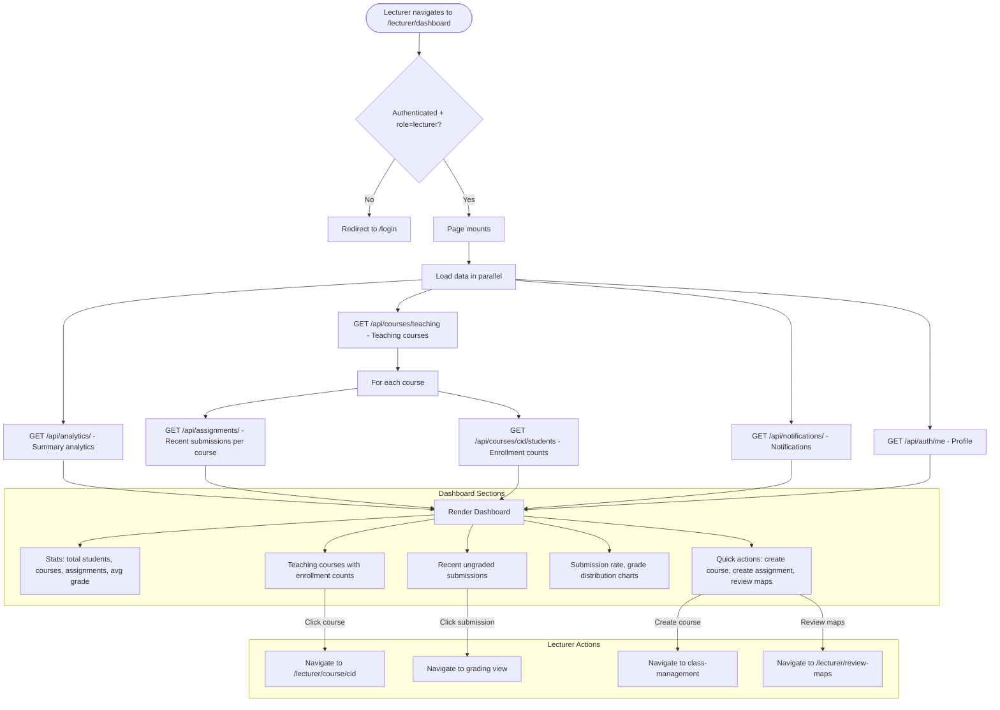

# Lecturer Dashboard Flow

## Overview
The lecturer dashboard provides an overview of teaching activities, class analytics, recent submissions, and management shortcuts.

## Flowchart

## Key Files
- `frontend-web/src/app/(dashboard)/lecturer/dashboard/page.tsx` — Lecturer dashboard
- `frontend-web/src/lib/api.ts` — coursesApi.teaching, analyticsApi
- `frontend-mobile/lib/screens/home_screen.dart` — Mobile home (role-aware)
- `backend/app/routers/analytics.py` — Analytics aggregation
- `backend/app/routers/courses.py` — Teaching courses endpoint
