# Course Management Flow

## Overview
Covers course creation by lecturers, student enrollment via join codes, and course content management (assignments, quizzes, resources, announcements, discussions, forum).

## Flowchart

```mermaid
flowchart TD
    subgraph Lecturer - Create Course
        L_START([Lecturer opens class management]) --> L_FORM[Fill: course name, code, semester, description]
        L_FORM --> L_CREATE[POST /api/courses/ with course data]
        L_CREATE --> L_JOINCODE[Backend generates unique joinCode]
        L_JOINCODE --> L_SAVE[Save to Firestore courses collection]
        L_SAVE --> L_DONE[Course created, show joinCode to share]
    end

    subgraph Student - Join Course
        S_START([Student opens join course]) --> S_CODE[Enter join code]
        S_CODE --> S_JOIN[POST /api/courses/join with code]
        S_JOIN --> S_LOOKUP{Course found?}
        S_LOOKUP -->|No| S_ERROR[Show error: invalid code]
        S_LOOKUP -->|Yes| S_ENROLLED{Already enrolled?}
        S_ENROLLED -->|Yes| S_ALREADY[Show: already enrolled]
        S_ENROLLED -->|No| S_ADD[Add studentId to enrolledStudents array]
        S_ADD --> S_NOTIFY[Create notification for lecturer]
        S_NOTIFY --> S_SUCCESS[Student can access course]
    end

    subgraph Course Content Structure
        COURSE([Course page /course/cid]) --> TABS[Tabbed navigation]
        TABS --> TAB_OVERVIEW[Overview - description, lecturer, enrollment]
        TABS --> TAB_ASSIGN[Assignments tab]
        TABS --> TAB_QUIZ[Quizzes tab]
        TABS --> TAB_RESOURCE[Resources/Modules tab]
        TABS --> TAB_ANNOUNCE[Announcements tab]
        TABS --> TAB_DISCUSS[Discussions tab]
        TABS --> TAB_FORUM[Forum tab]
        TABS --> TAB_ATTENDANCE[Attendance tab]
    end

    subgraph Content CRUD - Lecturer
        TAB_ASSIGN -->|Lecturer| A_CRUD[Create / Edit / Delete assignments]
        TAB_QUIZ -->|Lecturer| Q_CRUD[Create / Edit / Delete quizzes + questions]
        TAB_RESOURCE -->|Lecturer| R_CRUD[Create modules, upload items - PDFs, links, videos]
        TAB_ANNOUNCE -->|Lecturer| AN_CRUD[Create / Delete announcements]
        TAB_DISCUSS -->|Lecturer| D_MODERATE[Post messages, moderate]
        TAB_FORUM -->|Lecturer| F_CRUD[Create topics, manage posts, pin topics]
    end

    subgraph Content Access - Student
        TAB_ASSIGN -->|Student| A_VIEW[View assignments, submit work]
        TAB_QUIZ -->|Student| Q_VIEW[View quizzes, take attempts]
        TAB_RESOURCE -->|Student| R_VIEW[Browse modules, open resources]
        TAB_ANNOUNCE -->|Student| AN_VIEW[Read announcements]
        TAB_DISCUSS -->|Student| D_CHAT[Post messages, reply]
        TAB_FORUM -->|Student| F_VIEW[Browse topics, post replies]
    end

    subgraph RAG Indexing on Content Change
        A_CRUD --> RAG_INDEX[Trigger RAG indexing]
        Q_CRUD --> RAG_INDEX
        R_CRUD --> RAG_INDEX
        AN_CRUD --> RAG_INDEX
        RAG_INDEX --> CHROMADB[Update ChromaDB vector store for course]
    end
```

## Key Files
- `frontend-web/src/app/(dashboard)/student/courses/page.tsx` — Student courses list
- `frontend-web/src/app/(dashboard)/student/course/[cid]/page.tsx` — Course overview
- `frontend-web/src/app/(dashboard)/lecturer/class-management/page.tsx` — Lecturer course management
- `frontend-mobile/lib/screens/subjects_screen.dart` — Mobile courses list
- `frontend-mobile/lib/screens/subject_detail_screen.dart` — Mobile course detail
- `backend/app/routers/courses.py` — Course CRUD + enrollment
- `backend/app/routers/assignments.py` — Assignment CRUD
- `backend/app/routers/quizzes.py` — Quiz CRUD
- `backend/app/routers/resources.py` — Module/resource CRUD
