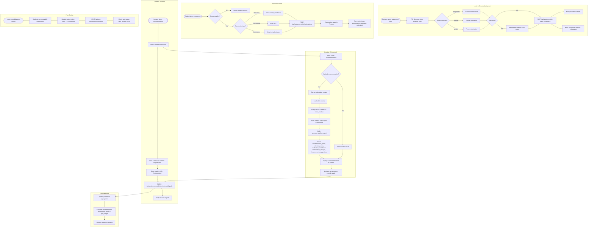

# Assignment Workflow

## Overview
Complete lifecycle from lecturer creating an assignment, students submitting work, grading (manual or AI-assisted), peer reviews, and feedback delivery.

## Flowchart

## Key Files
- `frontend-web/src/app/(dashboard)/student/course/[cid]/assignments/page.tsx` — Student assignments
- `frontend-web/src/app/(dashboard)/lecturer/course/[cid]/assignments/page.tsx` — Lecturer assignments
- `frontend-web/src/components/ai-grade-recommendation.tsx` — AI grading UI
- `frontend-mobile/lib/screens/assignments_tab.dart` — Mobile assignments
- `frontend-mobile/lib/screens/student_submit_screen.dart` — Mobile submission
- `backend/app/routers/assignments.py` — Assignment CRUD + submissions
- `backend/app/routers/ai_grading.py` — AI grade recommendation
- `backend/app/gag_service.py` — generate_grading_report()
- `backend/app/routers/peer_review.py` — Peer review system
