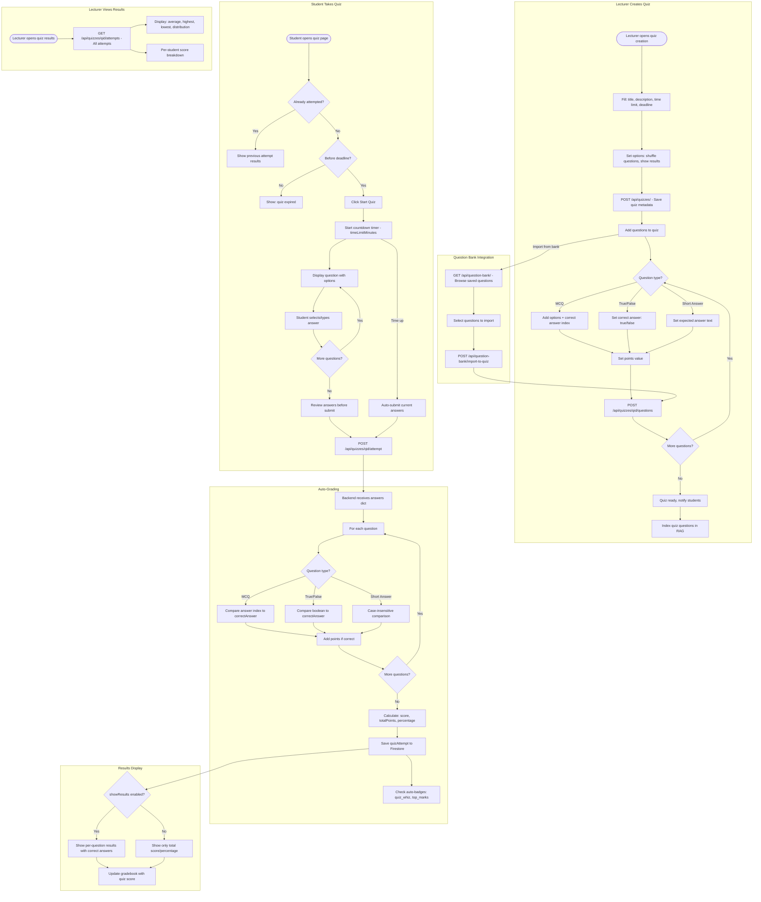

# Quiz Workflow

## Overview
Full quiz lifecycle: creation with question types, student attempts with timer, auto-grading, results display, and integration with gradebook.

## Flowchart

## Key Files
- `frontend-web/src/app/(dashboard)/student/course/[cid]/quizzes/page.tsx` — Student quiz view
- `frontend-web/src/app/(dashboard)/lecturer/course/[cid]/quizzes/page.tsx` — Lecturer quiz management
- `frontend-mobile/lib/screens/quizzes_screen.dart` — Mobile quiz screen
- `backend/app/routers/quizzes.py` — Quiz CRUD, questions, attempts, results
- `backend/app/routers/question_bank.py` — Reusable question pool
- `backend/app/routers/gradebook.py` — Gradebook integration
