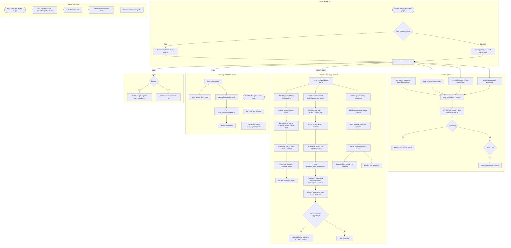

# Mind Map Workflow

## Overview
Covers mind map creation using React Flow editor, AI Buddy assistance with RAG + knowledge graph, sharing/collaboration, and lecturer review.

## Flowchart

## Key Files
- `frontend-web/src/app/(dashboard)/student/create-map/page.tsx` — Map editor page
- `frontend-web/src/components/map-editor/` — React Flow custom nodes, shape palette, properties panel
- `frontend-web/src/components/map-editor/mindmap-buddy.tsx` — AI Buddy widget
- `frontend-web/src/lib/export-map.ts` — PNG/PDF export utilities
- `frontend-mobile/lib/screens/mind_maps_screen.dart` — Mobile map list
- `frontend-mobile/lib/screens/mind_map_viewer.dart` — Mobile map viewer
- `backend/app/routers/maps.py` — Map CRUD, collaboration, search
- `backend/app/routers/ai_mindmap_buddy.py` — AI analysis, suggestions, chat
- `backend/app/knowledge_graph_service.py` — Concept graph queries
