# AI Companion (SmartBuddy) Flow

## Overview
Floating AI chat widget available on every student page. Uses RAG-retrieved course materials, student context (courses, grades, timetable), and VARK learning style to provide personalized, grounded responses with source citations.

## Flowchart

```mermaid
flowchart TD
    START([Student clicks SmartBuddy chat icon]) --> WIDGET_OPEN[Open floating chat widget]

    subgraph Initialize Chat
        WIDGET_OPEN --> LOAD_HISTORY[GET /api/ai/companion/history]
        LOAD_HISTORY --> LOAD_PROFILE[GET /api/ai/companion/learning-profile]
        LOAD_PROFILE --> CHECK_STYLE{Learning style set?}
        CHECK_STYLE -->|No| PROMPT_VARK[Suggest: Take learning style assessment]
        CHECK_STYLE -->|Yes| READY[Chat ready with last 20 messages]
    end

    subgraph Student Sends Message
        READY --> USER_MSG[Student types message]
        USER_MSG --> SEND[POST /api/ai/companion/chat]
    end

    subgraph Backend Processing
        SEND --> VERIFY_ROLE{role = student?}
        VERIFY_ROLE -->|No| REJECT[403: Students only]
        VERIFY_ROLE -->|Yes| LOAD_LP[Load learning profile from Firestore]

        LOAD_LP --> LOAD_HIST[Load last 20 chat messages]
        LOAD_HIST --> GATHER_CTX[Gather comprehensive student context]

        subgraph Context Gathering - _get_student_context
            GATHER_CTX --> CTX_COURSES[Query enrolled courses with codes]
            CTX_COURSES --> CTX_DEADLINES[Query upcoming assignment deadlines + submission status]
            CTX_DEADLINES --> CTX_QUIZZES[Query upcoming quizzes + attempt status]
            CTX_QUIZZES --> CTX_SCORES[Query quiz scores - last 20 attempts]
            CTX_SCORES --> CTX_GRADES[Query assignment grades]
            CTX_GRADES --> CTX_WEAK[Identify weak areas - scored below 60 percent]
            CTX_WEAK --> CTX_TIMETABLE[Load all saved timetables with schedules]
            CTX_TIMETABLE --> CTX_REMINDERS[Query pending reminders/tasks]
            CTX_REMINDERS --> CTX_TEXT[Format as context string]
        end

        CTX_TEXT --> RAG_RETRIEVE[RAG: retrieve top 5 chunks from enrolled course materials]

        subgraph RAG Retrieval
            RAG_RETRIEVE --> EMBED_QUERY[Embed student message with text-embedding-004]
            EMBED_QUERY --> SEARCH_CHROMA[Search ChromaDB across course collections]
            SEARCH_CHROMA --> RANK_CHUNKS[Rank by cosine similarity]
            RANK_CHUNKS --> FORMAT_RAG[Format context + extract citations]
        end

        FORMAT_RAG --> BUILD_PROMPT[Build system prompt]

        subgraph System Prompt Assembly
            BUILD_PROMPT --> SP_KB[Knowledge base: rag_companion instructions]
            SP_KB --> SP_NAME[Student name]
            SP_NAME --> SP_STYLE[Learning style: visual/auditory/reading/kinesthetic]
            SP_STYLE --> SP_PAGE[Current page context]
            SP_PAGE --> SP_META[Student metadata: courses, deadlines, scores, timetable]
            SP_META --> SP_RAG[Retrieved course materials with source tags]
        end

        SP_RAG --> FORMAT_HIST[Format chat history for Gemini]
        FORMAT_HIST --> GEMINI_CALL[Gemini 2.5 Flash: chat_completion with system instruction]
        GEMINI_CALL --> RESPONSE[AI response with Source N citations]
    end

    subgraph Save and Return
        RESPONSE --> APPEND_HISTORY[Append user msg + AI response to history]
        APPEND_HISTORY --> TRIM[Keep last 50 messages]
        TRIM --> SAVE_HISTORY[Update/create aiChatHistory in Firestore]
        SAVE_HISTORY --> RETURN[Return response + sources array]
    end

    subgraph Display Response
        RETURN --> RENDER_MSG[Render AI message in chat bubble]
        RENDER_MSG --> RENDER_SOURCES{Has sources?}
        RENDER_SOURCES -->|Yes| SHOW_CITATIONS[Show expandable source cards with titles]
        RENDER_SOURCES -->|No| DONE[Message displayed]
        SHOW_CITATIONS --> DONE
    end

    subgraph Chat Management
        WIDGET_OPEN --> CLEAR_BTN[Clear history button]
        CLEAR_BTN --> DELETE_HIST[DELETE /api/ai/companion/history]
        DELETE_HIST --> FRESH[Fresh chat session]
    end
```

## Key Files
- `frontend-web/src/components/ai-companion/ai-companion-widget.tsx` — Floating chat widget
- `frontend-web/src/components/ai-companion/learning-style-setup.tsx` — VARK assessment
- `frontend-web/src/lib/api.ts` — aiCompanionApi namespace
- `frontend-mobile/lib/screens/ai_companion_screen.dart` — Mobile AI chat
- `frontend-mobile/lib/widgets/ai_companion_fab.dart` — Mobile FAB toggle
- `backend/app/routers/ai_companion.py` — Chat, history, learning profile endpoints
- `backend/app/rag_service.py` — retrieve(), format_context(), format_citations()
- `backend/app/ai_service.py` — chat_completion(), get_knowledge_base()
