# AI Study Guide Flow

## Overview
Daily personalized study recommendations powered by VARK learning style assessment, RAG-retrieved materials, GAG structured generation, and timetable-aware scheduling. Includes timetable upload/save management.

## Flowchart

```mermaid
flowchart TD
    START([Student opens /student/study-guide]) --> PAGE_MOUNT[Page mounts]

    subgraph VARK Learning Style Gate
        PAGE_MOUNT --> CHECK_PROFILE[GET /api/ai/companion/learning-profile]
        CHECK_PROFILE --> HAS_STYLE{Learning style set?}
        HAS_STYLE -->|Yes| LOAD_GUIDE[Proceed to load Daily Guide]
        HAS_STYLE -->|No| SHOW_VARK[Show VARK assessment intro]

        SHOW_VARK --> FETCH_Q[GET /api/ai/companion/assess-style]
        FETCH_Q --> DISPLAY_Q[Display 5 VARK questions one by one]

        DISPLAY_Q --> Q1[Q1: When learning something new I prefer to...]
        Q1 --> Q2[Q2: I remember information best when I...]
        Q2 --> Q3[Q3: During a lecture I pay most attention when...]
        Q3 --> Q4[Q4: When solving a problem I usually...]
        Q4 --> Q5[Q5: My ideal study environment includes...]

        Q5 --> TALLY[Tally answers: count visual, auditory, reading, kinesthetic]
        TALLY --> DETERMINE[Determine dominant style]
        DETERMINE --> SAVE_PROFILE[POST /api/ai/companion/learning-profile]
        SAVE_PROFILE --> SHOW_RESULT[Show VARK result card with style description]
        SHOW_RESULT --> USER_CONTINUE[Student clicks View My Recommendations]
        USER_CONTINUE --> LOAD_GUIDE
    end

    subgraph Load Daily Guide
        LOAD_GUIDE --> SHOW_SKELETON[Show inline loading skeleton cards]
        SHOW_SKELETON --> API_CALL[GET /api/ai/study-plan/daily-guide]
    end

    subgraph Backend - Daily Guide Generation
        API_CALL --> GATHER[Gather student data]
        GATHER --> G_COURSES[Query enrolled courses]
        G_COURSES --> G_DEADLINES[Query upcoming assignments + submission status]
        G_DEADLINES --> G_QUIZZES[Query upcoming quizzes + attempt status]
        G_QUIZZES --> G_SCORES[Query quiz performance scores]
        G_SCORES --> G_GRADES[Query assignment grades]
        G_GRADES --> G_WEAK[Identify weak topics - below 60 percent]
        G_WEAK --> G_TIMETABLE[Load ALL saved timetables from Firestore]
        G_TIMETABLE --> G_CONTEXT[Build student_context dict]

        G_CONTEXT --> RAG_CALL[RAG: retrieve materials for weak topics]

        subgraph RAG Retrieval
            RAG_CALL --> EMBED[Embed weak topics query]
            EMBED --> SEARCH[Search ChromaDB across course collections]
            SEARCH --> TOP5[Return top 5 relevant chunks]
        end

        TOP5 --> GAG_CALL[GAG: generate_study_plan_artifact]

        subgraph GAG Generation
            GAG_CALL --> BUILD_PROMPT[Build prompt with performance, timetable, deadlines, RAG context]
            BUILD_PROMPT --> SCHEDULE_RULES[Scheduling rules: fit study in free gaps between classes]
            SCHEDULE_RULES --> GEMINI[Gemini 2.5 Flash: generate JSON]
            GEMINI --> PARSE_JSON[Parse structured response]
        end

        PARSE_JSON --> ENRICH[Enrich resource_links from RAG sources]
        ENRICH --> RETURN_GUIDE[Return recommendations + daily_schedule_summary + motivational_message]
    end

    subgraph Display Guide
        RETURN_GUIDE --> HIDE_SKELETON[Hide loading skeleton]
        HIDE_SKELETON --> SUMMARY_BAR[Show summary: total recs, high priority count, learning style badge]
        SUMMARY_BAR --> SCHEDULE_BANNER[Show daily schedule summary banner]
        SCHEDULE_BANNER --> MOTIVATION[Show motivational message card]
        MOTIVATION --> REC_CARDS[Render recommendation cards sorted by suggested_time]

        subgraph Each Recommendation Card
            REC_CARDS --> CARD_COURSE[Course name + priority badge]
            CARD_COURSE --> CARD_TOPIC[Topic title]
            CARD_TOPIC --> CARD_TIME[Suggested time slot - AM/PM format]
            CARD_TIME --> CARD_REASON[Reason - references performance data]
            CARD_REASON --> CARD_DIFF[Difficulty rating dots 1-5]
            CARD_DIFF --> CARD_EST[Estimated study duration]
            CARD_EST --> CARD_EXPAND{Expand card?}
            CARD_EXPAND -->|Yes| CARD_ACTIVITIES[Suggested activities list]
            CARD_EXPAND -->|Yes| CARD_RESOURCES[Related resource links from RAG]
        end
    end

    subgraph Timetable Management Tab
        PAGE_MOUNT --> TAB_TIMETABLE[Timetable Analysis tab]

        TAB_TIMETABLE --> UPLOAD_CHOICE{Input method?}
        UPLOAD_CHOICE -->|Paste text| TEXT_INPUT[Enter timetable text]
        UPLOAD_CHOICE -->|Upload PDF| PDF_UPLOAD[Select PDF file]

        TEXT_INPUT --> ANALYZE_TEXT[POST /api/ai/study-plan/timetable-analyze]
        PDF_UPLOAD --> ANALYZE_PDF[POST /api/ai/study-plan/timetable-upload]

        ANALYZE_TEXT --> AI_EXTRACT[AI extracts schedule + recommends study times]
        ANALYZE_PDF --> AI_EXTRACT

        AI_EXTRACT --> SHOW_PARSED[Display parsed schedule table - sorted Mon to Sun]
        SHOW_PARSED --> SHOW_STUDY_SLOTS[Display recommended study time cards]
        SHOW_STUDY_SLOTS --> SAVE_SECTION[Show save section]

        SAVE_SECTION --> LABEL_INPUT[Enter semester label - e.g. Semester 2 2025/2026]
        LABEL_INPUT --> SAVE_BTN[Click Save Timetable]
        SAVE_BTN --> SAVE_API[POST /api/ai/study-plan/timetables]
        SAVE_API --> REFRESH_LIST[Refresh saved timetables list]

        TAB_TIMETABLE --> LIST_SAVED[GET /api/ai/study-plan/timetables]
        LIST_SAVED --> SHOW_SAVED[Display saved timetables with semester labels]
        SHOW_SAVED --> DELETE_BTN[Delete button per timetable]
        DELETE_BTN --> DELETE_API[DELETE /api/ai/study-plan/timetables/id]
        DELETE_API --> REFRESH_LIST
    end
```

## Key Files
- `frontend-web/src/app/(dashboard)/student/study-guide/page.tsx` — Study guide page with VARK + daily guide + timetable tabs
- `frontend-web/src/lib/api.ts` — aiStudyPlanApi, aiCompanionApi namespaces
- `frontend-mobile/lib/screens/ai_study_guide_screen.dart` — Mobile study guide
- `backend/app/routers/ai_study_plan.py` — daily-guide, timetable-analyze, timetable CRUD
- `backend/app/gag_service.py` — generate_study_plan_artifact()
- `backend/app/rag_service.py` — retrieve() for weak topic materials
- `backend/app/routers/ai_companion.py` — learning-profile, assess-style
