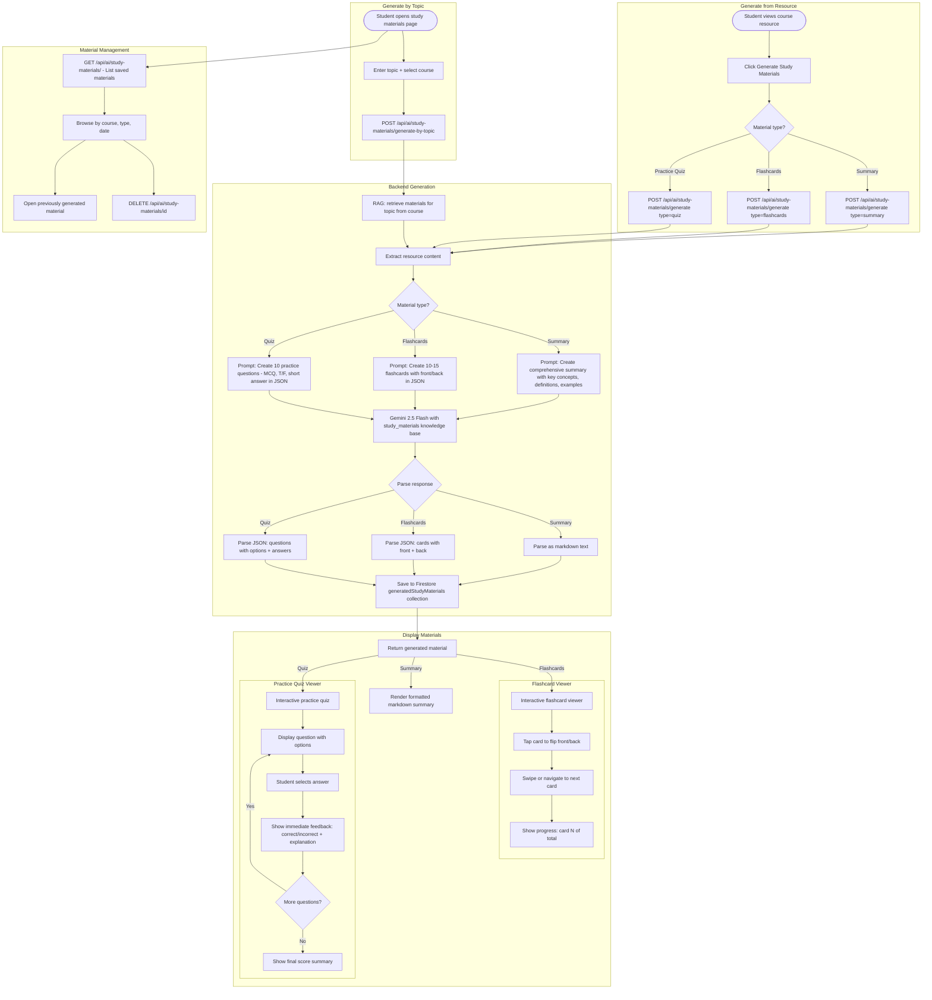

# AI Study Materials Flow

## Overview
Students can generate AI-powered study materials (summaries, flashcards, practice quizzes) from course resources or by topic. Materials are persisted for later review.

## Flowchart

## Key Files
- `frontend-web/src/app/(dashboard)/student/study-materials/page.tsx` — Study materials page
- `frontend-web/src/components/ai-study-materials/` — Viewers for summaries, flashcards, quizzes
- `frontend-mobile/lib/screens/ai_study_materials_screen.dart` — Mobile study materials
- `frontend-mobile/lib/screens/ai_summary_viewer.dart` — Mobile summary viewer
- `frontend-mobile/lib/screens/ai_flashcard_viewer.dart` — Mobile flashcard viewer
- `frontend-mobile/lib/screens/ai_practice_quiz_screen.dart` — Mobile practice quiz
- `backend/app/routers/ai_study_materials.py` — Generate, list, delete endpoints
- `backend/app/ai_service.py` — generate_json(), get_knowledge_base("study_materials")
