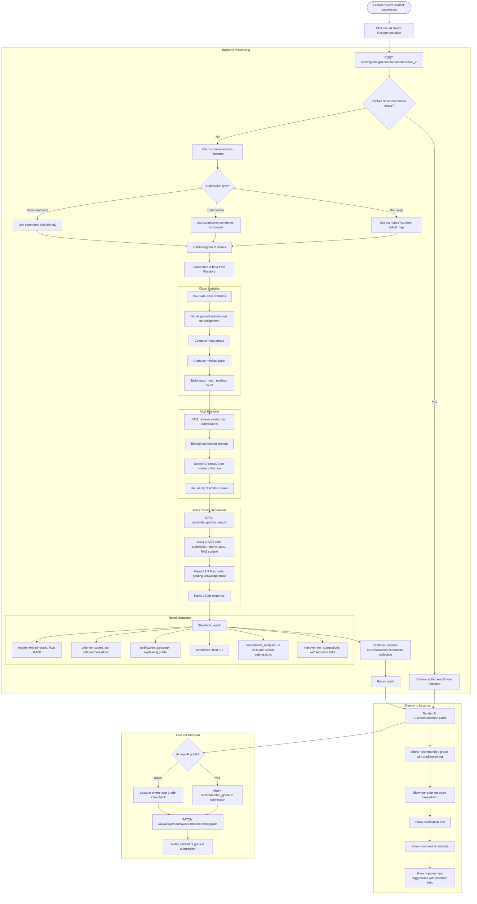

# AI Grading Flow

## Overview
AI-assisted grading for lecturers using RAG-retrieved similar submissions, rubric criteria, class statistics, and GAG structured report generation with per-criterion scores and improvement suggestions.

## Flowchart

## Key Files
- `frontend-web/src/components/ai-grade-recommendation.tsx` — AI grade recommendation UI
- `frontend-web/src/lib/api.ts` — aiGradingApi.recommend(), aiGradingApi.getRecommendation()
- `backend/app/routers/ai_grading.py` — POST /api/ai/grading/recommend, GET recommendation
- `backend/app/gag_service.py` — generate_grading_report()
- `backend/app/rag_service.py` — retrieve() for similar submissions
