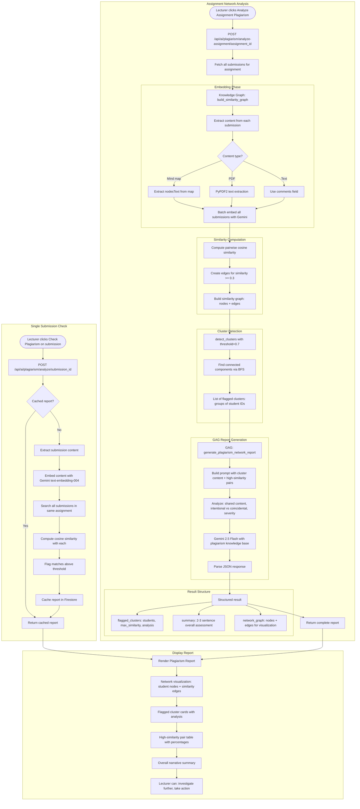

# AI Plagiarism Detection Flow

## Overview
Plagiarism detection system using embedding-based similarity analysis, cluster detection, and GAG narrative report generation. Supports single submission checks and full assignment network analysis.

## Flowchart

## Key Files
- `frontend-web/src/app/(dashboard)/lecturer/course/[cid]/plagiarism/page.tsx` — Plagiarism detection page
- `frontend-web/src/components/ai-plagiarism-report.tsx` — Report visualization
- `frontend-web/src/lib/api.ts` — aiPlagiarismApi namespace
- `backend/app/routers/ai_plagiarism.py` — Analyze single, analyze assignment endpoints
- `backend/app/knowledge_graph_service.py` — build_similarity_graph(), detect_clusters()
- `backend/app/gag_service.py` — generate_plagiarism_network_report()
