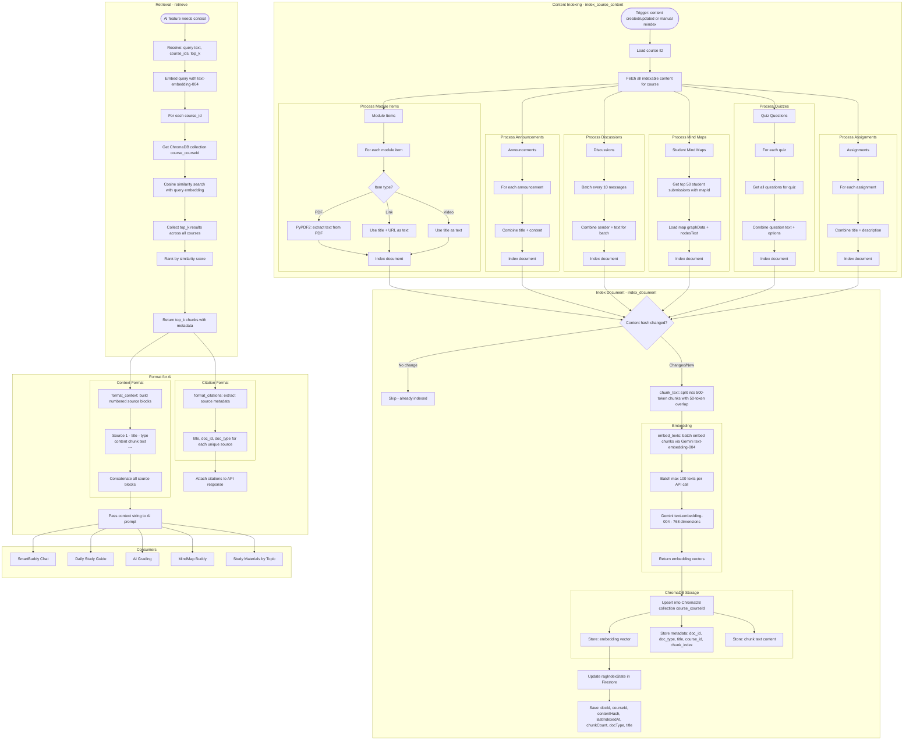

# RAG Pipeline Flow

## Overview
Retrieval-Augmented Generation pipeline: indexes course content into ChromaDB vector store, embeds queries, retrieves relevant chunks, and formats context for AI generation. Used by SmartBuddy, Daily Guide, AI Grading, Plagiarism, and MindMap Buddy.

## Flowchart

## Key Files
- `backend/app/rag_service.py` — Core RAG implementation: init_chroma, index_document, index_course_content, retrieve, format_context, format_citations, chunk_text, embed_texts
- `backend/app/routers/rag_admin.py` — RAG admin endpoints for indexing status/triggers
- `backend/vector_store/` — ChromaDB persistent storage directory
