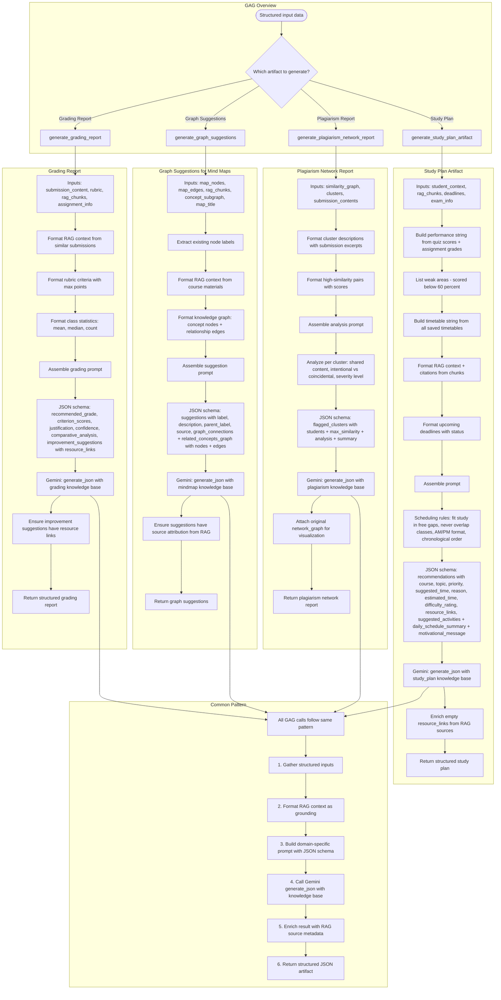

# GAG Pipeline Flow

## Overview
Generation-Augmented Generation (GAG) service produces structured JSON artifacts beyond simple text responses. Takes RAG-retrieved context and generates study plans, grading reports, graph suggestions, and plagiarism network reports.

## Flowchart

## Key Files
- `backend/app/gag_service.py` — All 4 GAG generation functions
- `backend/app/ai_service.py` — generate_json(), get_knowledge_base()
- `backend/app/rag_service.py` — format_context(), format_citations()
