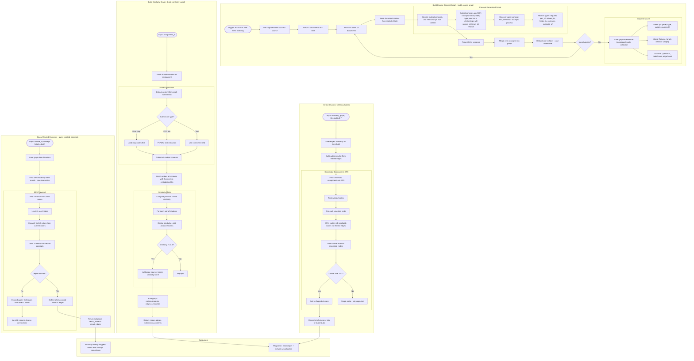

# Knowledge Graph Flow

## Overview
Per-course concept graphs extracted from indexed content via Gemini. Used for mind map suggestions (concept connections) and plagiarism detection (embedding-based similarity graphs with cluster detection).

## Flowchart

## Key Files
- `backend/app/knowledge_graph_service.py` — build_course_graph, query_related_concepts, build_similarity_graph, detect_clusters
- `backend/app/rag_service.py` — embed_texts() used for similarity embeddings
- `backend/app/routers/ai_mindmap_buddy.py` — Consumer: node suggestions
- `backend/app/routers/ai_plagiarism.py` — Consumer: plagiarism analysis
