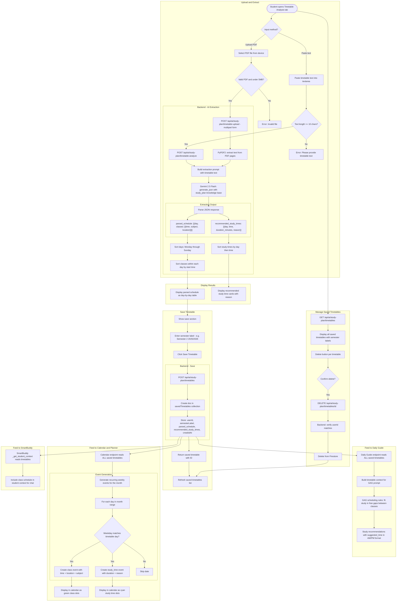

# Timetable Workflow

## Overview
Students upload or paste class timetables, AI extracts structured schedules and recommends study time slots. Timetables are saved with semester labels and feed into the Daily Guide and Calendar/Planner.

## Flowchart

## Key Files
- `frontend-web/src/app/(dashboard)/student/study-guide/page.tsx` — Timetable tab UI
- `frontend-web/src/lib/api.ts` — aiStudyPlanApi: analyzeTimetable, uploadTimetablePdf, saveTimetable, listTimetables, deleteTimetable
- `frontend-mobile/lib/screens/ai_study_guide_screen.dart` — Mobile timetable UI
- `backend/app/routers/ai_study_plan.py` — Timetable analyze, upload, CRUD endpoints
- `backend/app/routers/progress.py` — Calendar endpoint injects timetable events
- `backend/app/routers/ai_companion.py` — _get_student_context includes timetables
- `backend/app/gag_service.py` — Timetable context in study plan prompt
