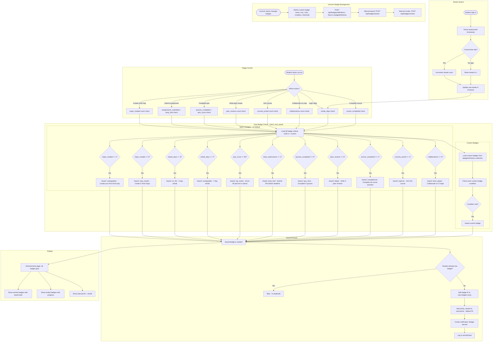

# Gamification Flow

## Overview
Badge, points, and streak system. 11 built-in badges auto-awarded based on student actions. Lecturers can create custom badges. Points accumulate from badge awards.

## Flowchart

## Key Files
- `frontend-web/src/app/(dashboard)/student/achievements/page.tsx` — Student achievements page
- `frontend-web/src/app/(dashboard)/lecturer/manage-badges/page.tsx` — Badge management
- `frontend-mobile/lib/screens/achievements_screen.dart` — Mobile achievements
- `frontend-mobile/lib/utils/badge_utils.dart` — Badge definitions for mobile
- `backend/app/routers/badges.py` — Badge CRUD, award, revoke, default badges
- `backend/app/routers/auto_badges.py` — Auto-award logic with condition checkers
- `backend/app/gamification.py` — Legacy gamification module
