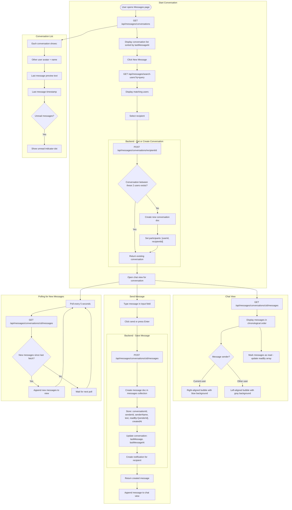

# Messaging Flow

## Overview
Private direct messaging between users (student-to-student, student-to-lecturer). Supports user search, conversation creation, real-time-like message display via polling.

## Flowchart

## Key Files
- `frontend-web/src/app/(dashboard)/student/messages/page.tsx` — Student messages page
- `frontend-web/src/app/(dashboard)/lecturer/messages/page.tsx` — Lecturer messages page
- `frontend-web/src/lib/api.ts` — messagingApi namespace
- `frontend-mobile/lib/screens/messaging_screen.dart` — Mobile messaging
- `backend/app/routers/messaging.py` — Conversations, messages, search endpoints
