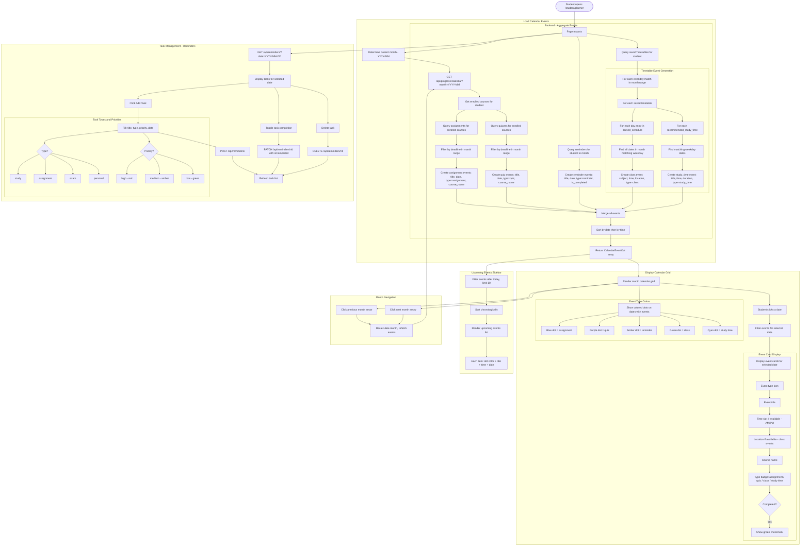

# Planner & Calendar Flow

## Overview
Unified calendar aggregating assignment deadlines, quiz deadlines, personal reminders/tasks, class events from saved timetables, and recommended study time slots. Task management with priority levels and completion tracking.

## Flowchart

## Key Files
- `frontend-web/src/app/(dashboard)/student/planner/page.tsx` — Student planner page
- `frontend-web/src/app/(dashboard)/student/calendar/page.tsx` — Redirect to planner
- `frontend-web/src/lib/api.ts` — progressApi.calendar(), remindersApi
- `frontend-mobile/lib/screens/calendar_screen.dart` — Mobile calendar
- `frontend-mobile/lib/screens/tasks_screen.dart` — Mobile task/planner
- `backend/app/routers/progress.py` — GET /api/progress/calendar with timetable injection
- `backend/app/routers/reminders.py` — Reminder CRUD
