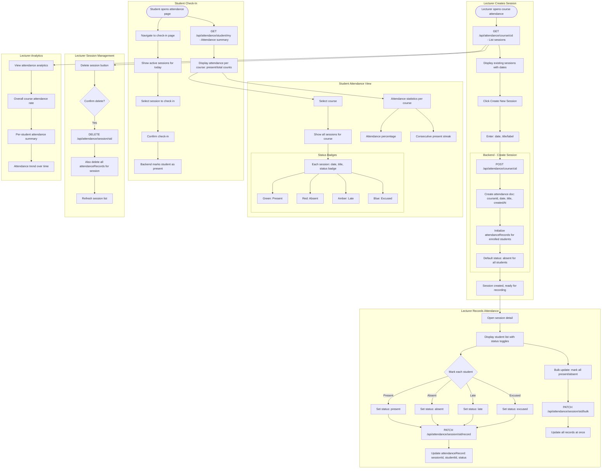

# Attendance Flow

## Overview
Session-based attendance tracking. Lecturers create attendance sessions, students check in, and attendance records are maintained per session. Supports bulk recording and student attendance history.

## Flowchart

## Key Files
- `frontend-web/src/app/(dashboard)/student/attendance/page.tsx` — Student attendance view
- `frontend-web/src/app/(dashboard)/student/attendance/check-in/page.tsx` — Student check-in
- `frontend-web/src/app/(dashboard)/lecturer/course/[cid]/attendance/page.tsx` — Lecturer attendance
- `frontend-web/src/lib/api.ts` — attendanceApi namespace
- `frontend-mobile/lib/screens/attendance_screen.dart` — Mobile attendance
- `backend/app/routers/attendance.py` — Session CRUD, record marking, student summary
