# MySmartStudy — Use Case Diagram

Renders on GitHub, VS Code (Markdown Preview Mermaid Support), Obsidian, and
[mermaid.live](https://mermaid.live).

Actors:
- **Student** — primary learner; consumes courses, submits work, builds maps.
- **Lecturer** — owns courses, creates assessments, grades, reviews maps.
- **Admin** — manages users, homepage content, broadcasts, site analytics.
- **AI Service** — secondary actor; serves all "AI ..." use cases via the
  `claude-api` / RAG pipelines (callable from Student or Lecturer flows).

```mermaid
flowchart LR
    %% ─── Actors ─────────────────────────────────────────────────────────────
    Student([Student])
    Lecturer([Lecturer])
    Admin([Admin])
    AI([AI Service])

    %% ─── System boundary ────────────────────────────────────────────────────
    subgraph SYS["MySmartStudy"]
        direction TB

        subgraph Auth["Authentication & Profile"]
            UC_Register(Register Account)
            UC_Login(Log In)
            UC_Logout(Log Out)
            UC_Reset(Reset Password)
            UC_Profile(Update Profile)
            UC_Avatar(Upload Avatar)
        end

        subgraph Maps["Mind Maps"]
            UC_CreateMap(Create Map)
            UC_EditMap(Edit / Auto-save Map)
            UC_Share(Share by Code or Email)
            UC_Visibility(Set Visibility)
            UC_Collab(Collaborate Realtime)
            UC_Export(Export PNG / PDF)
            UC_Like(Like Map)
            UC_CommentMap(Comment on Map)
            UC_History(View Map History)
            UC_ReviewMap(Review Student Map)
        end

        subgraph Courses["Courses"]
            UC_CreateCourse(Create Course)
            UC_EditCourse(Edit Course)
            UC_JoinCourse(Join via Code)
            UC_ViewCourses(View Courses)
        end

        subgraph Assign["Assignments & Grading"]
            UC_CreateAssign(Create Assignment)
            UC_Submit(Submit Assignment)
            UC_Grade(Grade Submission)
            UC_Feedback(Give Feedback)
            UC_Rubric(Define Rubric)
            UC_PeerReview(Peer Review)
        end

        subgraph Quizzes["Quizzes"]
            UC_CreateQuiz(Create Quiz)
            UC_TakeQuiz(Take Quiz)
            UC_QuizResults(View Results)
            UC_QuizAttempts(View Attempts)
        end

        subgraph Resources["Resources"]
            UC_Module(Create Module)
            UC_AddItem(Add Module Item)
            UC_ViewRes(Open Resources)
        end

        subgraph Comms["Communication"]
            UC_Announce(Post Announcement)
            UC_Discuss(Post in Course Chat)
            UC_Topic(Create Forum Topic)
            UC_DM(Direct Message)
        end

        subgraph Attend["Attendance"]
            UC_Session(Create Session + QR)
            UC_CheckIn(Check In via QR)
            UC_AttendSum(View Attendance)
        end

        subgraph Planner["Calendar & Planner"]
            UC_Reminder(Create Reminder)
            UC_Calendar(View Calendar)
            UC_Reflect(Write Reflection)
        end

        subgraph Social["Social Graph"]
            UC_Follow(Follow / Unfollow)
            UC_Feed(View Followers Feed)
            UC_Explore(Explore Public Maps)
        end

        subgraph Engagement["Engagement"]
            UC_Notif(View Notifications)
            UC_Cert(View Certificate)
            UC_Badge(Auto-Award Badge)
            UC_AwardBadge(Award Badge Manually)
        end

        subgraph Gradebook["Gradebook"]
            UC_MyGrades(View My Grades)
            UC_CourseGB(View Course Gradebook)
            UC_ExportGB(Export CSV)
        end

        subgraph AISvc["AI Features"]
            UC_Companion(Chat with AI Companion)
            UC_AIBuddy(AI Mindmap Buddy)
            UC_AISuggest(AI Suggest Nodes)
            UC_AIImage(Generate AI Image)
            UC_DailyGuide(AI Daily Guide)
            UC_StudyMat(Generate Study Materials)
            UC_StudyPlan(AI Study Plan)
            UC_Timetable(AI Timetable)
            UC_AIGrade(AI Grading Recommendation)
            UC_AIPlag(AI Plagiarism Check)
            UC_CLP(Generate CLP Document)
            UC_RAG(RAG Index Course Materials)
        end

        subgraph AdminMod["Admin Console"]
            UC_Homepage(Manage Homepage Content)
            UC_Broadcast(Broadcast Email)
            UC_BadgeDef(Define Badges)
            UC_Analytics(Site Analytics)
            UC_ManageUsers(Manage Users)
            UC_AdminAnalytics(User Sessions Stats)
        end
    end

    %% ─── Student associations ──────────────────────────────────────────────
    Student --> UC_Register & UC_Login & UC_Logout & UC_Reset
    Student --> UC_Profile & UC_Avatar
    Student --> UC_CreateMap & UC_EditMap & UC_Share & UC_Visibility
    Student --> UC_Collab & UC_Export & UC_Like & UC_CommentMap & UC_History
    Student --> UC_JoinCourse & UC_ViewCourses
    Student --> UC_Submit & UC_PeerReview
    Student --> UC_TakeQuiz & UC_QuizResults
    Student --> UC_ViewRes
    Student --> UC_Discuss & UC_Topic & UC_DM
    Student --> UC_CheckIn & UC_AttendSum
    Student --> UC_Reminder & UC_Calendar & UC_Reflect
    Student --> UC_Follow & UC_Feed & UC_Explore
    Student --> UC_Notif & UC_Cert
    Student --> UC_MyGrades
    Student --> UC_Companion & UC_AIBuddy & UC_AISuggest
    Student --> UC_AIImage & UC_DailyGuide & UC_StudyMat
    Student --> UC_StudyPlan & UC_Timetable

    %% ─── Lecturer associations ─────────────────────────────────────────────
    Lecturer --> UC_Register & UC_Login & UC_Logout & UC_Reset
    Lecturer --> UC_Profile & UC_Avatar
    Lecturer --> UC_CreateCourse & UC_EditCourse & UC_ViewCourses
    %% NOTE: UC_Feedback intentionally omitted — it's reached via «include» from UC_Grade.
    Lecturer --> UC_CreateAssign & UC_Grade & UC_Rubric
    Lecturer --> UC_CreateQuiz & UC_QuizAttempts
    Lecturer --> UC_Module & UC_AddItem
    Lecturer --> UC_Announce & UC_Discuss & UC_Topic & UC_DM
    Lecturer --> UC_Session
    Lecturer --> UC_ReviewMap
    Lecturer --> UC_Reminder & UC_Calendar
    Lecturer --> UC_Notif & UC_AwardBadge
    Lecturer --> UC_CourseGB & UC_ExportGB
    Lecturer --> UC_AIGrade & UC_AIPlag & UC_CLP

    %% ─── Admin associations ────────────────────────────────────────────────
    Admin --> UC_Login & UC_Logout & UC_Profile
    Admin --> UC_Homepage & UC_Broadcast & UC_BadgeDef
    Admin --> UC_Analytics & UC_ManageUsers & UC_AdminAnalytics
    Admin --> UC_RAG

    %% ─── AI Service associations (secondary actor — system reaches out) ───
    %% Per UML, secondary actors are drawn with the arrow pointing FROM the use
    %% case TO the actor (the system uses the actor to fulfill the request).
    UC_Companion  --> AI
    UC_AIBuddy    --> AI
    UC_AISuggest  --> AI
    UC_AIImage    --> AI
    UC_DailyGuide --> AI
    UC_StudyMat   --> AI
    UC_StudyPlan  --> AI
    UC_Timetable  --> AI
    UC_AIGrade    --> AI
    UC_AIPlag     --> AI
    UC_CLP        --> AI
    UC_RAG        --> AI

    %% ─── «include» relationships (base ALWAYS invokes the included UC) ──
    %% Direction: base ......> included.
    UC_Grade -.->|«include»| UC_Feedback

    %% ─── «extend» relationships (extension OPTIONALLY adds to base) ──────
    %% Direction: extension ......> base.
    %% Grouped by base use case for readability.

    %% Extensions of "Grade Submission"
    UC_AIGrade     -.->|«extend»| UC_Grade
    UC_AIPlag      -.->|«extend»| UC_Grade
    UC_Rubric      -.->|«extend»| UC_Grade

    %% Extensions of "Submit Assignment"
    UC_PeerReview  -.->|«extend»| UC_Submit
    UC_Badge       -.->|«extend»| UC_Submit

    %% Extensions of "Take Quiz"
    UC_QuizResults -.->|«extend»| UC_TakeQuiz

    %% Extensions of "Edit Map"
    UC_AIBuddy     -.->|«extend»| UC_EditMap
    UC_AISuggest   -.->|«extend»| UC_EditMap
    UC_AIImage     -.->|«extend»| UC_EditMap

    %% Extensions of "Explore Public Maps"
    UC_Like        -.->|«extend»| UC_Explore
    UC_CommentMap  -.->|«extend»| UC_Explore

    %% Extensions of "View Calendar"
    UC_DailyGuide  -.->|«extend»| UC_Calendar
    UC_StudyPlan   -.->|«extend»| UC_Calendar
    UC_Timetable   -.->|«extend»| UC_Calendar

    %% Extensions of "Open Resources" / "Add Module Item"
    UC_StudyMat    -.->|«extend»| UC_ViewRes
    UC_RAG         -.->|«extend»| UC_AddItem
```

## UML Semantics Used

Following the conventions on [uml-diagrams.org](https://www.uml-diagrams.org/use-case-diagrams.html):

| Element | Meaning | Mermaid syntax |
|---------|---------|----------------|
| **Actor → Use Case** (solid arrow) | Primary actor *initiates* the flow | `Student --> UC_X` |
| **Use Case → Actor** (solid arrow) | Use case communicates with a *secondary* actor that the system relies on | `UC_X --> AI` |
| **Base → Included** (dotted, `«include»`) | Base use case **always** invokes the included one — reusable shared behavior | `UC_Grade -.->\|«include»\| UC_Feedback` |
| **Extension → Base** (dotted, `«extend»`) | Extension **optionally** adds behavior to the base at a defined extension point | `UC_AIPlag -.->\|«extend»\| UC_Grade` |

## Reading the Relationships

- **Every use case has at least one actor connection** (directly, or transitively via include/extend reaching a use case that does).
- `Give Feedback` has no direct actor — it is purely included behavior of `Grade Submission` (the only place feedback is captured).
- `Auto-Award Badge` has no direct actor — it is an extension point that fires conditionally on `Submit Assignment`.
- The 12 AI use cases each have a *primary* actor (Student / Lecturer / Admin) who initiates and the AI Service as a *secondary* actor that fulfills.

## Modeling Choices

- **Auth & profile are drawn explicitly for all three actors** rather than using actor generalization. This keeps role-specific differences (e.g. only Admin can register accounts via the broadcast page) visible at a glance.
- **Notification creation is not modeled as «include»** even though e.g. posting an announcement does insert a notification record. That insertion is a system-internal side effect, not a sub-flow the announcer "performs". `View Notifications` is a separate use case the recipient performs later.
- **`Auto-Award Badge` does not point to AI Service** — auto-award uses deterministic rules in `auto_badges.py`, not a model call.
- **Excluded:** AI cache collections, CLP draft session details, FCM tokens, audit logs — plumbing, not user-facing flows.
- **Real-time features** (collab polling, discussion auto-refresh) are modeled as single use cases; the polling cadence is an implementation detail.
